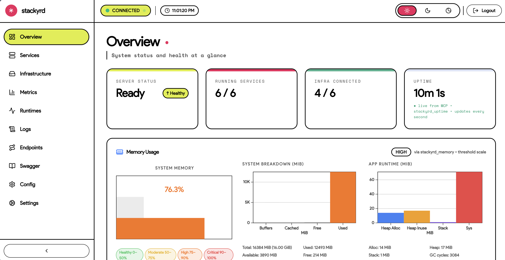

# Stackyrd Web Dashboard

<p align="center">
  
  
  
  
  
</p>

<p align="center">
  Admin dashboard for managing the <strong>stackyrd</strong> service framework.<br />
  Real-time monitoring via MCP polling with a playful, bold design language.
</p>

---

## Overview

<div align="center">
  
</div>

## Features

| | |
|---|---|
| **Overview** | System health, uptime, resource usage, and instance identity at a glance |
| **Services** | Auto-discovered service modules with status and endpoint listing |
| **Infrastructure** | Connected components (DB, Redis, Kafka, etc.) with live status |
| **Metrics** | Prometheus metrics viewer with raw and grouped views |
| **Runtimes** | Goroutine histogram with leak detection — runs in background across navigation |
| **Logs** | Live event stream via SSE with pause, clear, and export |
| **Endpoints** | All registered REST endpoints grouped by service |
| **Swagger** | Embedded OpenAPI documentation |
| **Config** | View and manage stackyrd configuration |
| **Settings** | Theme (light / dark / night), API & MCP URL configuration |

## Tech Stack

| Layer | Choice |
|-------|--------|
| Framework | SvelteKit 2 + Svelte 5 runes |
| Styling | Tailwind CSS v4 + shadcn-svelte + bits-ui |
| Charts | svelteplot |
| Icons | Lucide Svelte |
| Fonts | Product Sans, Space Grotesk, Space Mono |
| Build | Vite 8 + TypeScript 6 (strict) |

## Prerequisites

- Node.js 18+
- npm or pnpm
- A running [stackyrd](https://github.com/stackyrd) instance (default: `http://localhost:8080`)

## Quick Start

```bash
npm install
cp .env.example .env
npm run dev
```

The dashboard is available at `http://localhost:5173`.

## Environment Variables

| Variable | Description | Default |
|----------|-------------|---------|
| `PUBLIC_API_URL` | Stackyrd REST API base URL | `http://localhost:8080` |
| `PUBLIC_MCP_URL` | Stackyrd MCP endpoint | `http://localhost:8080/mcp` |
| `PUBLIC_API_TOKEN` | Bearer token for authentication | *(empty)* |

## Scripts

| Command | Description |
|---------|-------------|
| `npm run dev` | Start Vite dev server with proxy |
| `npm run build` | Production build |
| `npm run preview` | Preview production build locally |
| `npm run check` | Type-check with svelte-check |
| `npm run check:watch` | Type-check in watch mode |

---

## Architecture

```mermaid
flowchart TB
    subgraph Browser["Browser (SvelteKit SPA)"]
        UI["Pages + Sidebar + TopBar"]
        Stores["Shared Stores\nhealth · services · infra\nmetrics · goroutines · logs]
        Poller["mcpPoller (background)\n· 3s batched MCP poll\n· 10s goroutine poll"]
        UI --> Stores
        Poller --> Stores
    end

    subgraph Proxy["Vite Dev Proxy"]
        P1["/mcp"]
        P2["/api"]
        P3["/health"]
        P4["/metrics"]
        P5["/swagger"]
    end

    subgraph Server["stackyrd Go Server (:8080)"]
        MCP["MCP JSON-RPC\n(batch + SSE)"]
        REST["REST Endpoints"]
        Prometheus["Prometheus /metrics"]
    end

    Stores --> Poller
    Poller --> P1
    UI --> P2
    UI --> P3
    UI --> P4
    UI --> P5
    P1 --> MCP
    P2 --> REST
    P3 --> REST
    P4 --> Prometheus
    P5 --> REST
```

### Polling Strategy

All MCP resources (health, services, infra, endpoints, uptime, resources, identity, memory) are fetched via a **single batched JSON-RPC request** every 3 seconds. Goroutine data is polled every 10 seconds. Both run in the background and survive page navigation — stores are shared singletons.

## Development Notes

- **No CORS needed** — the Vite dev server proxies `/api`, `/mcp`, `/health`, `/metrics`, and `/swagger` to `:8080`.
- **Three themes** — light (default), dark, and night. Persisted in `localStorage`.
- **Auth** — token validated via `POST /mcp` ping. Stored in `localStorage` as `stackyrd_auth`.

## License

See [LICENSE](./LICENSE).
